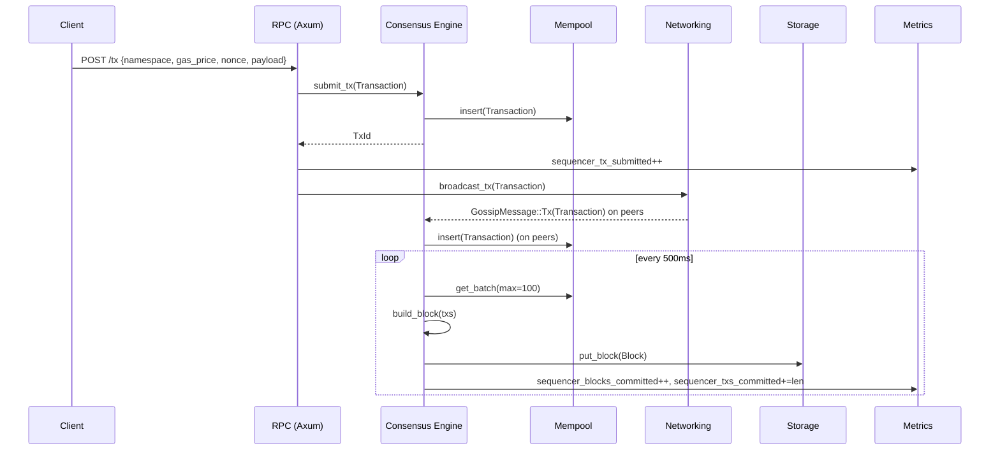
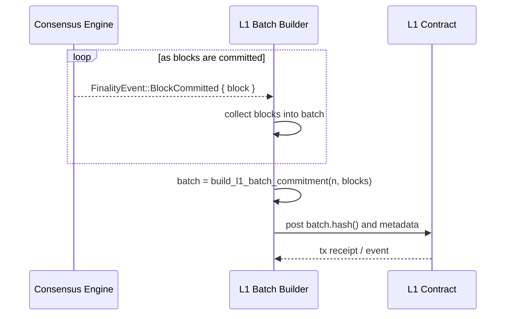

# High-Level Overview

This repository implements a **single-node rollup sequencer** with a minimal multi-node story via UDP gossip. The system is decomposed into small crates, each responsible for a clear concern:

- `types`: domain model (hashes, transactions, blocks, Merkle trees).
- `mempool`: in-memory, gas-price–aware transaction pool.
- `storage`: abstract storage traits + in-memory and sled-backed implementations.
- `consensus`: single-node, step-based consensus engine.
- `rpc`: Axum-based HTTP API for clients.
- `metrics`: Prometheus metrics recorder and helpers.
- `networking`: UDP-based gossip for transactions and (stubbed) blocks.
- `rollup-sequencer` (root crate): binary that wires all components together.

At runtime, each node:

1. Accepts transactions via HTTP (`/tx`).
2. Inserts them into its mempool and gossips them to peers.
3. Periodically runs consensus `step()` to build and commit blocks to storage.
4. Exposes metrics via HTTP (`/metrics`) for Prometheus.

## Component Architecture

### Component Diagram

```mermaid
graph TD
		Client[Client / Wallet] --> RPC[RPC (Axum)]
		RPC --> Consensus[Consensus Engine]
		RPC --> Metrics[Metrics Recorder]

		Consensus --> Mempool[Mempool]
		Consensus --> Storage[Storage]
		Consensus --> Metrics

		Consensus --> Networking[UDP Gossip]
		Networking --> Consensus

		Metrics -->|/metrics| Client
```

### Data Flow: Transaction Lifecycle



## Logical Components (LLD)

### `types` crate

- **IDs and hashes**:
	- `Hash([u8; 32])`, `TxId(Hash)`, `BlockId(Hash)`, `NamespaceId(u64)`.
	- `hash_bytes(&[u8]) -> Hash` using BLAKE3.
- **Transactions**:
	- `Transaction { namespace, gas_price, nonce, payload, signature }`.
	- `Transaction::id()` uses `bincode` encoding + `hash_bytes` for stable IDs.
- **Blocks**:
	- `BlockHeader { height, parent: Option<BlockId>, tx_root, state_root, timestamp_ms, proposer }`.
	- `Block { header, txs: Vec<TxId> }`.
- **Merkle trees**:
	- `merkle_root(&[TxId]) -> Hash`.
	- `merkle_proof(&[TxId], index) -> Option<MerkleProof>`.
	- `verify_merkle_proof(root, leaf, &proof) -> bool`.

### `mempool` crate

- Trait `Mempool` with methods:
	- `insert(tx) -> Result<TxId, MempoolError>`
	- `get_batch(limit) -> Vec<(TxId, Transaction)>`
	- `remove_committed(&[TxId])`
	- `len() -> usize`
- Implementation `SimpleMempool`:
	- Keeps an `HashMap<TxId, Transaction>` + FIFO insertion order.
	- `get_batch` prioritizes by **gas_price (desc)** then **insertion order**.
	- Metrics: `record_tx_submitted` and `record_mempool_size` on inserts / removals.

### `storage` crate

- Traits:
	- `BlockStore`: `put_block`, `get_block`, `get_block_by_height`.
	- `TxStore`: `put_tx`, `get_tx`.
	- `StateStore`: `put_state_root`, `latest_state_root`.
- `InMemoryStorage`:
	- HashMaps for blocks-by-id, blocks-by-height, txs, and state roots.
	- Used in tests and as a reference implementation.
- `SledStorage`:
	- sled DB with trees: `blocks`, `blocks_by_height`, `txs`, `state_roots`.
	- Keys: block IDs as raw bytes; heights as big-endian `u64`.
	- Uses `bincode` for block/tx encoding.
	- Instrumented with storage latency metrics per operation.

### `consensus` crate

The core of the current consensus is `SingleNodeConsensus<M, S>` implementing the `ConsensusEngine` trait.

- **Types**:
	- `ViewNumber(u64)` – logical view/counter of steps.
	- `ValidatorId([u8; 32])` – single, hard-coded validator.
	- `QuorumCertificate { view, block_id }` – synthetic QC per committed block.
	- `FinalityEvent::BlockCommitted { block, qc }` – emitted when a block is committed.

- **Engine state**:
	- `view: ViewNumber` – increments on each `step()`.
	- `validator: ValidatorId` – proposer ID embedded in headers.
	- `mempool: M: Mempool` – source of transactions.
	- `storage: S: BlockStore + StateStore + TxStore` – persistence.
	- `last_block_id: Option<BlockId>`, `last_height: u64` – chain tip.

- **Methods**:
	- `submit_tx(tx) -> Result<TxId, ConsensusError>`
		- Delegates to `mempool.insert(tx)` and returns the computed TxId.
	- `step() -> Result<Option<FinalityEvent>, ConsensusError>`
		- Increments `view`.
		- Calls `build_block()`:
			- Pulls up to 100 txs from the mempool.
			- Computes `tx_root` using `merkle_root`.
			- Builds `BlockHeader` with `height = last_height + 1`, `parent = last_block_id`.
		- If no txs are available, returns `Ok(None)`.
		- Otherwise:
			- Persists the block via `storage.put_block`.
			- Updates `last_block_id` and `last_height`.
			- Emits `FinalityEvent::BlockCommitted` with a synthetic `QuorumCertificate`.
			- Records metrics:
				- `sequencer_blocks_committed`
				- `sequencer_txs_committed`
				- `sequencer_consensus_step_ms` (step duration histogram).
		- Decorated with `#[tracing::instrument(skip(self))]` to create a tracing span.

#### Invariants

Under the current design, the following safety properties hold:

- **No forks at a given height**: at most one block ID can be committed at a given height.
- **Monotonic heights**: committed blocks have strictly increasing heights (1, 2, 3, ...).
- **Monotonic views**: the view number increases on every call to `step()`.

Tests in the `consensus` crate assert:

- That heights are strictly increasing across committed blocks.
- That no two distinct blocks are ever committed at the same height.

#### Towards multi-node consensus

For future work, `SingleNodeConsensus` can be extended or wrapped by a multi-node protocol with:

- A set of validators and a leader election scheme per view.
- Vote messages aggregated into real quorum certificates.
- Distinct proposal / vote / commit phases (2- or 3-phase BFT).

The current engine and its invariants serve as the execution and persistence layer for such a protocol.

### `rpc` crate

- Built on **Axum 0.7**.
- Shared state: `RpcInnerState<E>`:
	- `engine: Arc<tokio::sync::Mutex<E>>` (E implements `ConsensusEngine`).
	- `network: Option<NetworkHandle>` (for gossiping txs).
- Endpoints (documented in detail in `api.md`):
	- `GET /health` – liveness.
	- `POST /tx` – submit transaction.
	- `GET /metrics` – Prometheus metrics.
- `submit_tx_handler`:
	- Validates/deserializes JSON into `SubmitTxRequest`.
	- Builds a `Transaction` and calls `engine.submit_tx`.
	- On error, returns `500` with `{"error": "submit_tx failed: ..."}`.
	- On success, gossips the tx via `NetworkHandle::broadcast_tx`.
	- Returns the hex-encoded TxId.
- RPC handlers and server are instrumented with `tracing` spans.

### `metrics` crate

- Wraps `metrics` and `metrics-exporter-prometheus`.
- Provides:
	- `init_metrics()` – install global Prometheus recorder.
	- `render_metrics()` – render metrics as Prometheus text.
	- Counters/gauges: tx submitted, mempool size, blocks/txs committed.
	- Histograms: `sequencer_consensus_step_ms`, `sequencer_storage_op_ms{op}`.

### `networking` crate

- UDP-based gossip, intentionally minimal (not libp2p yet).
- Messages: `GossipMessage::{Tx(Transaction), Block(Block)}` serialized as JSON.
- `start_network(config, on_message)`:
	- Binds a UDP socket to `config.listen_addr`.
	- Spawns a receiver loop that parses incoming messages and invokes `on_message`.
	- Spawns a sender loop that broadcasts outgoing messages to all peers.

## Runtime Topology

### Two-node Local Demo

Two nodes running on a single machine are distinguished by `NODE_ID`:

- Node 1 (`NODE_ID=1`):
	- RPC: `127.0.0.1:8080`
	- Gossip UDP: `127.0.0.1:9001` (peer: `9002`)
	- Data dir: `./data_1`
- Node 2 (`NODE_ID=2`):
	- RPC: `127.0.0.1:8081`
	- Gossip UDP: `127.0.0.1:9002` (peer: `9001`)
	- Data dir: `./data_2`

Transactions submitted to Node 1 are gossiped to Node 2, which logs:

> received gossiped tx; inserting into local mempool

Both nodes independently run consensus and commit blocks with their own view of the mempool.

## External Interfaces

The primary external interfaces are HTTP APIs (see `api.md`) and the Prometheus `/metrics` endpoint for observability. The UDP gossip interface is considered internal to the sequencer cluster.

## L1 Settlement Integration

Although this repository does not talk to a real L1 chain, it models
the data that would be sent to an L1 settlement contract and includes
tests that exercise this path.

### L1 Batch Commitments

The `types` crate defines:

- `L1BatchCommitment { batch_number: u64, block_ids: Vec<BlockId> }`:
	- Represents a logical batch of L2 blocks to be settled on L1.
	- Provides `hash(&self) -> Hash`, a deterministic commitment hash
		over the batch contents. In a real deployment this hash (or an
		encoding of the structure) would be posted to L1.

The `consensus` crate exposes a helper:

- `build_l1_batch_commitment(batch_number, blocks: &[Block]) -> L1BatchCommitment`:
	- Takes a slice of committed blocks (typically obtained from
		`FinalityEvent::BlockCommitted`) and derives the batch object.

### Settlement Flow (Conceptual)

In a production system the settlement flow would look like this:



In this repository, the `L1` contract is replaced with a simple in
memory sink inside tests, but the same pattern of "subscribe to
finality, aggregate, then commit" applies.


